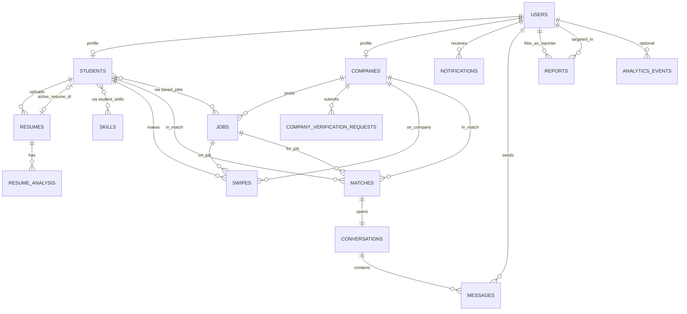

# KUPC Phase 3A — Database Architecture (Design)

**Status:** Complete (design gate — ready for Phase 3B implementation)  
**Date:** 2026-07-10  
**Source spec:** `documentation/KUPC_Phase3_Database_Design_Data_Modeling.md`  
**Depends on:** Phase 2 — Authentication & Authorization (complete)  
**Feeds into:** Phase 3B — migrations, indexes, RLS, seed data, repositories

---

## What Phase 3A is

Phase 3A is **design only**. No `CREATE TABLE`, no repository code, no seed scripts.

| Question | Answered by |
| --- | --- |
| What things does KUPC store? | **Entities** (Milestone 1) |
| What fields does each thing have? | **Attributes** (Milestone 2) |
| How do things connect? | **Relationships & ER diagram** (Milestone 3) |
| Is data stored without redundancy? | **Normalization** (Milestone 4) |

**Phase 2** answered: *Who is making this request?* (`users`, JWT, roles, sessions)  
**Phase 3** answers: *What does KUPC know about students, companies, jobs, swipes, chat, etc.?*

The database is not passive storage. It **defines product rules**:

- Can a student have multiple resumes? → table design
- Can a pending company post jobs? → `verification_status` + middleware (Phase 2) + `jobs` table (Phase 3)
- What counts as a match? → `swipes` + `matches` design

---

## Core concepts (explained)

### Entity

A **noun** the system treats as its own thing with a distinct meaning.

Examples: `Student`, `Job`, `Swipe`, `Message`.

**Three tests** (from the spec) — if **any** is yes, it usually gets its own table:

1. Does it have its own **lifecycle** (created / updated / deleted independently)?
2. Is it **referenced from more than one place**?
3. Does it have **attributes of its own**, separate from entities it relates to?

`User` vs `Student`: a `User` is login identity (email, role). A `Student` is a KU profile (CGPA, department, resume). Same person, different concerns → separate tables linked by shared `id`.

### Attribute

A **property** of an entity. In SQL this becomes a **column**.

Example: `Student.cgpa`, `Job.title`, `Swipe.direction`.

Attributes are grouped into three kinds (drives constraint decisions in 3B):

| Kind | Example | Constraint style |
| --- | --- | --- |
| **Identity** | `ku_id`, `company_name` | `NOT NULL`, often `UNIQUE` |
| **Optional profile** | `bio`, `logo_url` | Nullable — filled over time |
| **System-managed** | `created_at`, `verification_status` | `DEFAULT`, server-written only |

### Table, row, column

- **Table** = one entity type
- **Row** = one record (one student, one job)
- **Column** = one attribute

### Primary key (PK)

Uniquely identifies **one row** in a table.

KUPC convention:

- Most tables: `id UUID PRIMARY KEY DEFAULT gen_random_uuid()`
- `students` and `companies`: `id` **is the same UUID** as `users.id` (see identity inheritance below)

### Foreign key (FK)

A column that **must match** a primary key in another table. Postgres enforces referential integrity — you cannot insert a `job` with a fake `company_id`.

Example: `jobs.company_id → companies.id` — every job belongs to exactly one company.

### Identity inheritance (`students` / `companies` ↔ `users`)

```
users.id  ←──  students.id   (same UUID, FK with ON DELETE CASCADE)
users.id  ←──  companies.id  (same UUID, FK with ON DELETE CASCADE)
```

**Why:** `auth.uid()` from Supabase equals `users.id`, which equals `students.id` or `companies.id`. RLS policies and app queries need no extra join to answer "is this row mine?"

### Relationship types

| Type | Meaning | KUPC example |
| --- | --- | --- |
| **One-to-one (1:1)** | One A ↔ at most one B | `Match` ↔ `Conversation` |
| **One-to-many (1:N)** | One A → many B | `Company` → many `Jobs` |
| **Many-to-many (M:N)** | Many A ↔ many B | `Student` ↔ `Skill` — requires a **join table** |

### Join table

A table whose **only job** is linking two entities, often storing extra data about the link.

Example: `student_skills(student_id, skill_id, proficiency)`

**Never** store M:N as a comma-separated string:

```
❌ students.skills = "Python,React,SQL"
```

Problems: no canonical skill list, slow queries, no per-skill proficiency, no FK integrity.

### Join (SQL query concept)

Combining rows from multiple tables using FK relationships.

```sql
SELECT jobs.title, companies.company_name
FROM jobs
JOIN companies ON jobs.company_id = companies.id;
```

- `JOIN` (inner): only rows where FK matches PK on both sides
- `LEFT JOIN`: keep all rows from the left table even if no match on the right

Phase 3A designs **which FKs exist**; Phase 3B writes the SQL; application services write the `JOIN` queries in repositories.

### Normalization

Organizing data so **each fact lives in exactly one authoritative place**, preventing update anomalies.

| Form | Rule | KUPC example |
| --- | --- | --- |
| **1NF** | Atomic values; no repeating groups | Skills in `student_skills`, not CSV strings |
| **2NF** | Non-key columns depend on the **whole** composite PK | `proficiency` in `student_skills` depends on `(student_id, skill_id)` together |
| **3NF** | No column depends on another **non-key** column | Don't copy `company.verification_status` onto every `jobs` row |

We target **3NF**. Going further (BCNF, 4NF) adds join overhead without removing real redundancy for KUPC's access patterns. Controlled denormalization (e.g. cached counts) can be added later as documented exceptions.

### Constraints (preview — implemented in 3B)

| Constraint | Purpose | Example |
| --- | --- | --- |
| `NOT NULL` | Required field | `jobs.title` |
| `UNIQUE` | No duplicates | `students.ku_id`, `skills.name` |
| `CHECK` | Allowed values | `cgpa BETWEEN 0 AND 4` |
| `DEFAULT` | Server default | `created_at DEFAULT now()` |

Constraints are the **last line of defense** — they hold even if application validation is bypassed.

### Row Level Security — preview for 3B

Postgres feature: per-row access control at the database.

- Phase 2 **RBAC**: can this HTTP request reach this route?
- Phase 3 **RLS**: can this database query see or modify this row?

Both layers are used together. Admin operations use `service_role` (bypasses RLS) only in trusted server code.

---

## Phase 2 baseline (what already exists)

Applied migration: `supabase/migrations/20260709000000_phase2_auth_schema.sql`

| Table | Phase 2 columns | Phase 3A action |
| --- | --- | --- |
| `users` | `id`, `email`, `role`, `email_verified`, `status`, `created_at` | **Keep** — auth root |
| `students` | `id`, `ku_id`, `full_name`, `graduation_year`, `department` | **Extend** — add profile fields |
| `companies` | `id`, `company_name`, `website`, `verification_status`, `verified_at` | **Extend** — add profile fields |
| `sessions` | session metadata | **Keep** |
| `refresh_tokens` | rotation storage | **Keep** |
| `student_otps` | OTP hashes | **Keep** |
| `company_requests` | verification doc placeholder | **Rename** → `company_verification_requests` in 3B |

Phase 3A designs **14 logical entity groups** on top of this foundation (some map to new tables, some extend existing ones).

---

# Milestone 1 — Entity identification & domain modeling

Every noun from registration → profiles → resumes → jobs → swiping → matching → chat → notifications → moderation → analytics is listed below.

For each entity: **what it is**, **why it is separate**, and **which table** it maps to.

| # | Entity | Table | Why separate from others |
| --- | --- | --- | --- |
| 1 | **User** | `users` (Phase 2) | Authentication identity only — email, role, verification flags. Not a profile. |
| 2 | **Student** | `students` | KU-specific profile data; lifecycle distinct from login (profile completion after OTP). |
| 3 | **Company** | `companies` | Employer profile + `verification_status` workflow; distinct from auth user. |
| 4 | **Admin** | `users` (role=`ADMIN`) | No separate profile table in v1 — admin is a role on `users`. |
| 5 | **Resume** | `resumes` | File metadata; own lifecycle (upload, replace, history). |
| 6 | **Resume Analysis** | `resume_analysis` | AI/parsed output; separate from file — re-analysis without deleting file. |
| 7 | **Skill** | `skills` | Canonical tag list — one row per skill name globally. |
| 8 | **Student Skill** | `student_skills` | M:N link + proficiency — relationship has its own attributes. |
| 9 | **Job** | `jobs` | Company posting; many per company; own status lifecycle. |
| 10 | **Swipe** | `swipes` | One student decision on one job; immutable event log. |
| 11 | **Match** | `matches` | Mutual right-swipe outcome; spawns chat. |
| 12 | **Conversation** | `conversations` | Chat thread; 1:1 with match. |
| 13 | **Message** | `messages` | Individual chat message; many per conversation. |
| 14 | **Saved Job** | `saved_jobs` | Bookmark without swiping — different intent from swipe. |
| 15 | **Notification** | `notifications` | In-app alerts to any user. |
| 16 | **Company Verification Request** | `company_verification_requests` | Admin review queue item; many per company over time. |
| 17 | **Report** | `reports` | Moderation — reporter and target are both users. |
| 18 | **Analytics Event** | `analytics_events` | Append-only product telemetry. |
| 19 | **Session** | `sessions` (Phase 2) | Login session audit. |
| 20 | **Refresh Token** | `refresh_tokens` (Phase 2) | Rotating credential per session. |

### Entities intentionally **not** given tables

| Concept | Reason |
| --- | --- |
| "Login credentials" | Lives in Supabase `auth.users` + Phase 2 `users` row |
| "Admin profile" | Role flag on `users` is sufficient for v1 |
| "Match notification" | Modeled as `notifications` with `type` + `payload` JSONB |

### Domain boundaries (key design choices)

**`Resume` vs `Resume Analysis`:** A student re-uploads a resume → new `resumes` row → new `resume_analysis` row. Old analyses remain as history. Combining into one table would lose version history or force awkward JSON blobs.

**`Swipe` vs `Match`:** Every swipe is recorded (including left swipes). A match is a **derived outcome** when both sides swipe right. Separate tables make feed exclusion ("already swiped") and match listing simple queries.

**`Saved Job` vs `Swipe`:** Saving is intentional bookmarking without expressing hire interest. Different product action → different table.

---

# Milestone 2 — Attribute definition

Complete attribute list for every Phase 3 entity. Types shown are **target PostgreSQL types for 3B** — listed here for design review, not yet implemented.

---

## 2.1 `users` (Phase 2 — unchanged)

| Attribute | Type | Null | Notes |
| --- | --- | --- | --- |
| `id` | UUID PK, FK → `auth.users` | NO | Supabase Auth linkage |
| `email` | TEXT | NO | UNIQUE |
| `role` | TEXT | NO | `STUDENT`, `COMPANY`, `ADMIN` |
| `email_verified` | BOOLEAN | NO | Default false |
| `status` | TEXT | NO | `active`, `suspended`, `deleted` |
| `created_at` | TIMESTAMPTZ | NO | Default `now()` |

---

## 2.2 `students` (extend Phase 2 table)

| Attribute | Type | Null | Notes |
| --- | --- | --- | --- |
| `id` | UUID PK, FK → `users.id` | NO | Identity inheritance |
| `ku_id` | TEXT | NO | UNIQUE — email prefix, e.g. `st123456` |
| `full_name` | TEXT | NO | From registration |
| `phone` | TEXT | YES | Profile completion |
| `degree` | TEXT | YES | e.g. `BSc CSIT` |
| `department` | TEXT | YES | Exists in Phase 2 |
| `graduation_year` | INTEGER | YES | Exists in Phase 2 |
| `cgpa` | NUMERIC(3,2) | YES | CHECK `0 <= cgpa <= 4` |
| `bio` | TEXT | YES | Short self-description |
| `profile_picture_url` | TEXT | YES | Supabase Storage URL |
| `resume_id` | UUID FK → `resumes.id` | YES | Pointer to **active** resume |
| `created_at` | TIMESTAMPTZ | NO | Default `now()` |
| `updated_at` | TIMESTAMPTZ | NO | Trigger-maintained in 3B |

**Phase 2 already has:** `id`, `ku_id`, `full_name`, `graduation_year`, `department`  
**Phase 3B adds:** `phone`, `degree`, `cgpa`, `bio`, `profile_picture_url`, `resume_id`, `created_at`, `updated_at`

---

## 2.3 `companies` (extend Phase 2 table)

| Attribute | Type | Null | Notes |
| --- | --- | --- | --- |
| `id` | UUID PK, FK → `users.id` | NO | Identity inheritance |
| `company_name` | TEXT | NO | From registration |
| `industry` | TEXT | YES | e.g. `Technology`, `Finance` |
| `website` | TEXT | YES | Exists in Phase 2 |
| `description` | TEXT | YES | About the company |
| `logo_url` | TEXT | YES | Storage URL |
| `verification_status` | TEXT | NO | `pending`, `approved`, `rejected` |
| `verified_at` | TIMESTAMPTZ | YES | Exists in Phase 2 |
| `created_at` | TIMESTAMPTZ | NO | Default `now()` |
| `updated_at` | TIMESTAMPTZ | NO | Trigger-maintained in 3B |

---

## 2.4 `resumes` (new)

| Attribute | Type | Null | Notes |
| --- | --- | --- | --- |
| `id` | UUID PK | NO | `gen_random_uuid()` |
| `student_id` | UUID FK → `students.id` | NO | Owner |
| `file_url` | TEXT | NO | Supabase Storage path |
| `file_name` | TEXT | NO | Original filename |
| `uploaded_at` | TIMESTAMPTZ | NO | Default `now()` |

**Rule:** Many resumes per student (history). `students.resume_id` points at the current active one.

---

## 2.5 `resume_analysis` (new)

| Attribute | Type | Null | Notes |
| --- | --- | --- | --- |
| `id` | UUID PK | NO | |
| `resume_id` | UUID FK → `resumes.id` | NO | Which file was analyzed |
| `extracted_skills` | JSONB | YES | Parsed skill list from AI |
| `ats_score` | NUMERIC(5,2) | YES | 0–100 style score |
| `summary` | TEXT | YES | Human-readable analysis summary |
| `analyzed_at` | TIMESTAMPTZ | NO | Default `now()` |

**Rule:** Many analyses per resume allowed (re-run analysis). Full parsing logic is Phase 4; table exists in Phase 3.

---

## 2.6 `skills` (new)

| Attribute | Type | Null | Notes |
| --- | --- | --- | --- |
| `id` | UUID PK | NO | |
| `name` | TEXT | NO | UNIQUE — canonical spelling, e.g. `Python` |

---

## 2.7 `student_skills` (new — join table)

| Attribute | Type | Null | Notes |
| --- | --- | --- | --- |
| `student_id` | UUID FK → `students.id` | NO | Composite PK part |
| `skill_id` | UUID FK → `skills.id` | NO | Composite PK part |
| `proficiency` | TEXT | YES | CHECK: `beginner`, `intermediate`, `advanced` |

**Primary key:** `(student_id, skill_id)`

---

## 2.8 `jobs` (new)

| Attribute | Type | Null | Notes |
| --- | --- | --- | --- |
| `id` | UUID PK | NO | |
| `company_id` | UUID FK → `companies.id` | NO | Poster |
| `title` | TEXT | NO | Job title |
| `description` | TEXT | NO | Full posting body |
| `location` | TEXT | YES | City / remote |
| `job_type` | TEXT | YES | `internship`, `full_time`, `part_time` |
| `min_cgpa` | NUMERIC(3,2) | YES | Eligibility filter |
| `status` | TEXT | NO | `open`, `closed`, `draft` — default `open` |
| `created_at` | TIMESTAMPTZ | NO | |
| `updated_at` | TIMESTAMPTZ | NO | |

---

## 2.9 `swipes` (new)

| Attribute | Type | Null | Notes |
| --- | --- | --- | --- |
| `id` | UUID PK | NO | |
| `student_id` | UUID FK → `students.id` | NO | Who swiped |
| `company_id` | UUID FK → `companies.id` | NO | Job's company (denormalized for query speed — company derivable from job; kept for company-side swipe views) |
| `job_id` | UUID FK → `jobs.id` | NO | Job-scoped swipe |
| `direction` | TEXT | NO | `left` or `right` |
| `swiped_at` | TIMESTAMPTZ | NO | Default `now()` |

**UNIQUE:** `(student_id, company_id, job_id)` — one swipe per student per job.

**Design note on `company_id`:** Technically derivable via `jobs.company_id`. Included deliberately so company-side queries ("swipes on our jobs") do not always require joining through `jobs`. This is an acceptable, documented exception to pure 3NF for read-path performance.

---

## 2.10 `matches` (new)

| Attribute | Type | Null | Notes |
| --- | --- | --- | --- |
| `id` | UUID PK | NO | |
| `student_id` | UUID FK → `students.id` | NO | |
| `company_id` | UUID FK → `companies.id` | NO | |
| `job_id` | UUID FK → `jobs.id` | NO | |
| `matched_at` | TIMESTAMPTZ | NO | Default `now()` |

**UNIQUE:** `(student_id, company_id, job_id)` — prevents duplicate matches from race conditions.

---

## 2.11 `saved_jobs` (new — join table)

| Attribute | Type | Null | Notes |
| --- | --- | --- | --- |
| `student_id` | UUID FK → `students.id` | NO | Composite PK |
| `job_id` | UUID FK → `jobs.id` | NO | Composite PK |
| `saved_at` | TIMESTAMPTZ | NO | Default `now()` |

---

## 2.12 `conversations` (new)

| Attribute | Type | Null | Notes |
| --- | --- | --- | --- |
| `id` | UUID PK | NO | |
| `match_id` | UUID FK → `matches.id` | NO | UNIQUE — 1:1 with match |
| `created_at` | TIMESTAMPTZ | NO | |

---

## 2.13 `messages` (new)

| Attribute | Type | Null | Notes |
| --- | --- | --- | --- |
| `id` | UUID PK | NO | |
| `conversation_id` | UUID FK → `conversations.id` | NO | Thread |
| `sender_id` | UUID FK → `users.id` | NO | Student **or** company user |
| `content` | TEXT | NO | Message body |
| `read_at` | TIMESTAMPTZ | YES | Read receipt |
| `sent_at` | TIMESTAMPTZ | NO | Default `now()` |

**Why `sender_id` → `users` not `students`:** Companies also send messages. Both roles have a `users` row.

---

## 2.14 `notifications` (new)

| Attribute | Type | Null | Notes |
| --- | --- | --- | --- |
| `id` | UUID PK | NO | |
| `user_id` | UUID FK → `users.id` | NO | Recipient |
| `type` | TEXT | NO | e.g. `match`, `message`, `verification` |
| `payload` | JSONB | YES | Structured extra data |
| `read_at` | TIMESTAMPTZ | YES | |
| `created_at` | TIMESTAMPTZ | NO | |

---

## 2.15 `company_verification_requests` (rename from `company_requests`)

| Attribute | Type | Null | Notes |
| --- | --- | --- | --- |
| `id` | UUID PK | NO | |
| `company_id` | UUID FK → `companies.id` | NO | |
| `document_type` | TEXT | NO | e.g. `business_registration` |
| `file_url` | TEXT | YES | Storage URL — nullable until upload in Phase 4 |
| `status` | TEXT | NO | `pending`, `approved`, `rejected` |
| `created_at` | TIMESTAMPTZ | NO | |

Phase 2 `company_requests.file_url` is `NOT NULL`; Phase 3A relaxes to **nullable** to match spec (metadata-first placeholder).

---

## 2.16 `reports` (new)

| Attribute | Type | Null | Notes |
| --- | --- | --- | --- |
| `id` | UUID PK | NO | |
| `reporter_id` | UUID FK → `users.id` | NO | Who filed |
| `target_user_id` | UUID FK → `users.id` | NO | Who was reported |
| `reason` | TEXT | NO | Free-text or coded reason |
| `status` | TEXT | NO | `open`, `reviewed`, `dismissed` |
| `created_at` | TIMESTAMPTZ | NO | |

---

## 2.17 `analytics_events` (new)

| Attribute | Type | Null | Notes |
| --- | --- | --- | --- |
| `id` | UUID PK | NO | |
| `user_id` | UUID FK → `users.id` | YES | Nullable for anonymous/system events |
| `event_type` | TEXT | NO | e.g. `job_view`, `swipe_right` |
| `metadata` | JSONB | YES | Arbitrary structured context |
| `created_at` | TIMESTAMPTZ | NO | Append-only |

---

## 2.18 Phase 2 auth tables (unchanged in 3A)

`sessions`, `refresh_tokens`, `student_otps` — no attribute changes in Phase 3A.

---

# Milestone 3 — Relationship modeling & ER diagram

## 3.1 Relationship catalog

| From | To | Cardinality | FK column | ON DELETE (3B) | Meaning |
| --- | --- | --- | --- | --- | --- |
| `students` | `users` | N:1 | `students.id` → `users.id` | CASCADE | Profile cannot exist without auth user |
| `companies` | `users` | N:1 | `companies.id` → `users.id` | CASCADE | Same |
| `resumes` | `students` | N:1 | `student_id` | CASCADE | Resumes belong to student |
| `resume_analysis` | `resumes` | N:1 | `resume_id` | CASCADE | Analysis belongs to resume |
| `students` | `resumes` | N:1 (optional) | `resume_id` | SET NULL | Active resume pointer |
| `student_skills` | `students`, `skills` | M:N | both FKs | CASCADE | Skill link |
| `jobs` | `companies` | N:1 | `company_id` | CASCADE | Jobs belong to company |
| `swipes` | `students`, `companies`, `jobs` | N:1 each | three FKs | CASCADE | Swipe event |
| `matches` | `students`, `companies`, `jobs` | N:1 each | three FKs | CASCADE | Match event |
| `saved_jobs` | `students`, `jobs` | M:N | both FKs | CASCADE | Bookmark |
| `conversations` | `matches` | 1:1 | `match_id` UNIQUE | CASCADE | One chat per match |
| `messages` | `conversations` | N:1 | `conversation_id` | CASCADE | Messages in thread |
| `messages` | `users` | N:1 | `sender_id` | CASCADE | Sender identity |
| `notifications` | `users` | N:1 | `user_id` | CASCADE | Recipient |
| `company_verification_requests` | `companies` | N:1 | `company_id` | CASCADE | Many requests over time |
| `reports` | `users` | N:1 ×2 | `reporter_id`, `target_user_id` | CASCADE | Moderation |
| `analytics_events` | `users` | N:1 optional | `user_id` | SET NULL | Keep history if user deleted |

## 3.2 ER diagram (conceptual)



## 3.3 Critical flows (how relationships behave)

### Student swipe → possible match

```
Student swipes right on Job J (company C)
  → INSERT swipes (student, C, J, 'right')
  → Check: did C already swipe right on this student for J?
      → If yes: INSERT matches + INSERT conversations
      → If no:  done (swipe recorded only)
```

`UNIQUE (student_id, company_id, job_id)` on both `swipes` and `matches` prevents duplicates if two requests race.

### Match → chat

```
One match row
  → Exactly one conversation (match_id UNIQUE)
  → Many messages (conversation_id FK)
  → sender_id always a users.id (student or company account)
```

### Resume upload → analysis (Phase 4 implements logic; Phase 3 defines schema)

```
Upload file → INSERT resumes
  → Analysis job runs → INSERT resume_analysis
  → UPDATE students.resume_id = new resume id
Old resumes + old analyses remain as history.
```

## 3.4 Circular dependency: `students.resume_id` ↔ `resumes.student_id`

```
students.resume_id  →  resumes.id
resumes.student_id  →  students.id
```

**3B resolution (designed, not yet implemented):**

1. Create `students` **without** FK on `resume_id` (column nullable)
2. Create `resumes` with FK to `students`
3. `ALTER TABLE students ADD CONSTRAINT ... FOREIGN KEY (resume_id) REFERENCES resumes(id) ON DELETE SET NULL`

## 3.5 Table creation order (for 3B)

```
users (exists)
  → students, companies (extend)
  → skills
  → resumes
  → ALTER students.resume_id FK
  → resume_analysis, student_skills
  → jobs
  → swipes, matches, saved_jobs
  → conversations, messages
  → notifications, company_verification_requests, reports, analytics_events
```

---

# Milestone 4 — Normalization analysis

Each entity group is checked against 1NF, 2NF, and 3NF.

## 4.1 Students & companies (profiles)

| Check | Result |
| --- | --- |
| 1NF | Each column atomic — no multi-valued `department` lists |
| 2NF | Single-column PK (`id`) — all attributes depend on full key |
| 3NF | `verification_status` on `companies` only — not copied to `jobs` or `students` |

✅ Normalized.

## 4.2 Skills & student_skills

| Anti-pattern | Fix |
| --- | --- |
| `students.skills = "Python,React"` | `skills` + `student_skills` join table |

| Check | Result |
| --- | --- |
| 1NF | One skill per `skills` row |
| 2NF | `proficiency` depends on full `(student_id, skill_id)` |
| 3NF | Skill name lives only in `skills.name` |

✅ Normalized.

## 4.3 Jobs

| Anti-pattern | Fix |
| --- | --- |
| Storing `company_name` on `jobs` | `jobs.company_id` FK only |

✅ Normalized. Company name retrieved via JOIN when needed.

## 4.4 Swipes & matches

| Anti-pattern | Fix |
| --- | --- |
| Single table with `is_match` boolean only | Separate `swipes` (all events) and `matches` (outcomes) |
| Storing match inside swipe row | `matches` table with own `matched_at` |

**Documented exception:** `swipes.company_id` is derivable from `jobs.company_id` but kept for query performance (see §2.9).

## 4.5 Chat

| Check | Result |
| --- | --- |
| 1NF | `content` is one message body per row |
| 3NF | `sender_id` references `users` — sender name not duplicated (read from profile via JOIN) |

✅ Normalized.

## 4.6 Notifications & analytics

Semi-structured variable data (`payload`, `metadata`) uses **JSONB** — acceptable in 3NF because these are not deterministically derivable from other columns; they are event snapshots.

## 4.7 Normalization verdict

| Form | Status |
| --- | --- |
| 1NF | ✅ Pass — no repeating groups |
| 2NF | ✅ Pass — all composite keys correct |
| 3NF | ✅ Pass — one documented denormalization (`swipes.company_id`) |

---

# Design decisions locked for Phase 3B

These were open in early 3A; they are now **final**:

| # | Decision | Resolution |
| --- | --- | --- |
| 1 | Rename `company_requests`? | **Yes** → `company_verification_requests` |
| 2 | Extend vs recreate `students`/`companies`? | **ALTER** existing tables (preserves Phase 2 data) |
| 3 | `job_id` nullable on swipes? | **No** — all swipes are job-scoped |
| 4 | Multiple analyses per resume? | **Yes** — history preserved |
| 5 | `messages.sender_id` → `users`? | **Yes** — both roles send messages |
| 6 | Separate `admins` table? | **No** — `users.role = ADMIN` |
| 7 | `company_requests.file_url` NOT NULL? | **Relax to nullable** per spec |
| 8 | UUID vs integer PKs? | **UUID** everywhere except composite PKs on join tables |

---

# Phase 3A exit checklist

| Item | Status |
| --- | --- |
| Every KUPC entity named and justified (Milestone 1) | ✅ |
| Every entity has full attribute list with types and nullability (Milestone 2) | ✅ |
| Relationships classified; ER diagram produced (Milestone 3) | ✅ |
| Schema verified against 1NF, 2NF, 3NF (Milestone 4) | ✅ |
| Gap vs Phase 2 tables documented | ✅ |
| Design decisions locked for 3B | ✅ |
| No SQL written in 3A | ✅ |

**Phase 3A is complete.** Phase 3B may begin: PostgreSQL migrations, indexes, RLS, seed data, repositories, and tests.

---

# What you do next (Phase 3B — you write the code)

When you are ready, start **Milestone 5–6** from the main Phase 3 spec:

1. Create migration file(s) under `supabase/migrations/` — extend `students`/`companies`, add new tables in dependency order
2. Handle `students.resume_id` circular FK with deferred `ALTER TABLE`
3. Rename `company_requests` → `company_verification_requests`

Ask for a specific milestone and I will give you **exact file paths and SQL snippets to type** — I will not edit files unless you ask.

---

*KUPC — Phase 3A: Database Architecture — Design complete*
